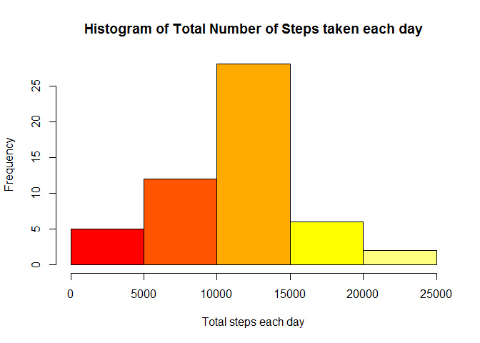
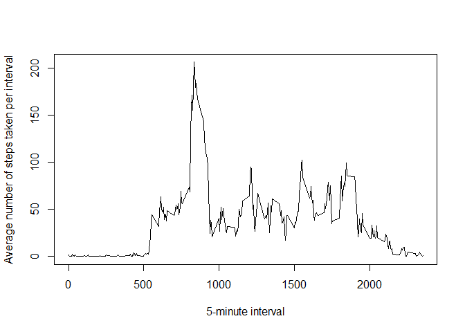
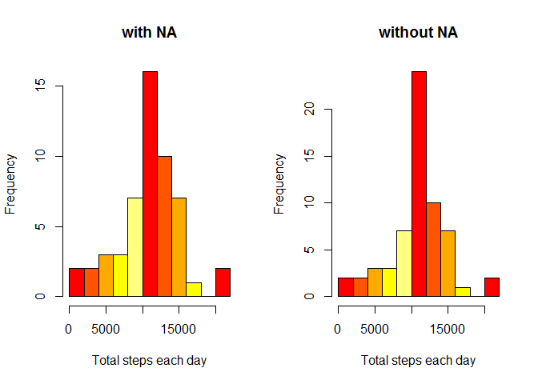
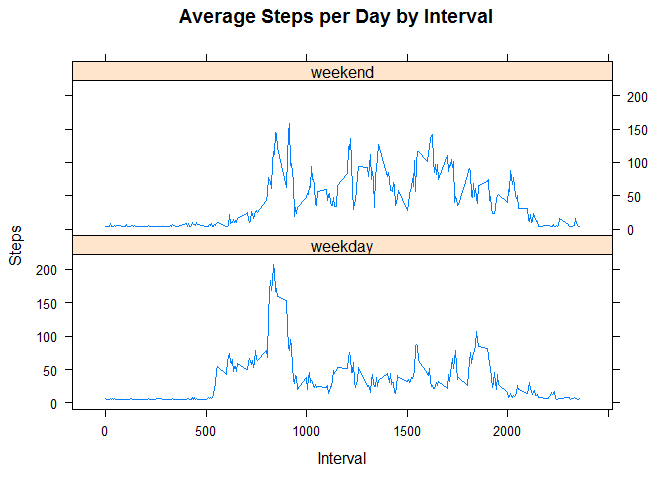

# Reproducible Research Course Project 1
Marsela Yulita  
16 August 2017  

##Introduction

It is now possible to collect a large amount of data about personal movement using activity monitoring devices such as a Fitbit, Nike Fuelband, or Jawbone Up. These type of devices are part of the "quantified self" movement - a group of enthusiasts who take measurements about themselves regularly to improve their health, to find patterns in their behavior, or because they are tech geeks. 


##1. Loading and preprocessing the data
####1.1 Setting the echo is TRUE

```r
knitr::opts_chunk$set(echo = TRUE)
```

####1.2 Loading the data

```r
activity <- read.csv("activity.csv")
str(activity)
```

```
## 'data.frame':	17568 obs. of  3 variables:
##  $ steps   : int  NA NA NA NA NA NA NA NA NA NA ...
##  $ date    : Factor w/ 61 levels "2012-10-01","2012-10-02",..: 1 1 1 1 1 1 1 1 1 1 ...
##  $ interval: int  0 5 10 15 20 25 30 35 40 45 ...
```

####1.3 Process/transform the data into a format suitable for analysis

```r
activity$steps <- as.numeric(activity$steps)
activity$date <- as.Date(activity$date, format = "%Y-%m-%d")
activity$interval <- as.numeric(activity$interval)
str(activity)
```

```
## 'data.frame':	17568 obs. of  3 variables:
##  $ steps   : num  NA NA NA NA NA NA NA NA NA NA ...
##  $ date    : Date, format: "2012-10-01" "2012-10-01" ...
##  $ interval: num  0 5 10 15 20 25 30 35 40 45 ...
```

##2. What is mean total number of steps taken per day?
####2.1 Calculate the total number of steps taken per day

```r
steps_per_day <- aggregate(steps ~ date, data = activity, sum, na.rm = TRUE)
```

####2.2 Make a histogram of the total number of steps taken each day

```r
hist(steps_per_day$steps,col=heat.colors(5), xlab="Total steps each day",main="Histogram of Total Number of Steps taken each day")
```

<!-- -->

####2.3 Calculate and report the mean and median of the total number of steps taken per day

```r
mean(steps_per_day$steps)
```

```
## [1] 10766.19
```

```r
median(steps_per_day$steps)
```

```
## [1] 10765
```

##3. What is the average daily activity pattern?
####3.1 Make a time series plot (i.e. type = "l") of the 5-minute interval (x-axis) and the average number of steps taken, averaged across all days (y-axis)

```r
steps_per_interval<- aggregate(steps ~ interval, data = activity, FUN = mean, na.rm = TRUE)
plot(steps_per_interval$interval,steps_per_interval$steps, type = "l", xlab="5-minute interval", ylab="Average number of steps taken per interval")
```

<!-- -->

####3.2 Which 5-minute interval, on average across all the days in the dataset, contains the maximum number of steps?

```r
max(steps_per_interval$interval[which.max(steps_per_interval$steps)])
```

```
## [1] 835
```

##4. Imputing missing values
####4.1 Calculate and report the total number of missing values in the dataset (i.e. the total number of rows with NAs)

```r
sum(is.na(activity))
```

```
## [1] 2304
```

####4.2 Devise a strategy for filling in all of the missing values in the dataset. The strategy does not need to be sophisticated. For example, you could use the mean/median for that day, or the mean for that 5-minute interval, etc.
I will replace the missing value in dataset with 1 fixed value that is mean of total steps or mean(activity$steps).

####4.3 Create a new dataset that is equal to the original dataset but with the missing data filled in.

```r
activity_new <- activity
activity_new$steps[is.na(activity_new$steps)] <- mean(na.omit(activity$steps))
sum(is.na(activity_new))
```

```
## [1] 0
```

####4.4 Make a histogram of the total number of steps taken each day and Calculate and report the mean and median total number of steps taken per day. Do these values differ from the estimates from the first part of the assignment? What is the impact of imputing missing data on the estimates of the total daily number of steps?

```r
steps_per_day2 <- aggregate(steps ~ date, data = activity_new, sum, na.rm = TRUE)
par(mfrow=c(1,2))
hist(steps_per_day$steps,col=heat.colors(5), xlab="Total steps each day",main="with NA",breaks=10)
hist(steps_per_day2$steps,col=heat.colors(5), xlab="Total steps each day",main="without NA",breaks=10)
```

<!-- -->

```r
summary(steps_per_day$steps)
```

```
##    Min. 1st Qu.  Median    Mean 3rd Qu.    Max. 
##      41    8841   10765   10766   13294   21194
```

```r
summary(steps_per_day2$steps)
```

```
##    Min. 1st Qu.  Median    Mean 3rd Qu.    Max. 
##      41    9819   10766   10766   12811   21194
```
The impact of imputing missing data makes the data more homogen than data with missing values.


##5. Are there differences in activity patterns between weekdays and weekends?
####5.1 Create a new factor variable in the dataset with two levels - "weekday" and "weekend" indicating whether a given date is a weekday or weekend day.

```r
activity_new$weekday <- factor(format(activity_new$date, "%A"))
levels(activity_new$weekday) <- list(weekday = c("Monday", "Tuesday","Wednesday","Thursday","Friday"), weekend =c("Saturday", "Sunday"))
str(activity_new)
```

```
## 'data.frame':	17568 obs. of  4 variables:
##  $ steps   : num  37.4 37.4 37.4 37.4 37.4 ...
##  $ date    : Date, format: "2012-10-01" "2012-10-01" ...
##  $ interval: num  0 5 10 15 20 25 30 35 40 45 ...
##  $ weekday : Factor w/ 2 levels "weekday","weekend": 1 1 1 1 1 1 1 1 1 1 ...
```

####5.2 Make a panel plot containing a time series plot (i.e. type = "l") of the 5-minute interval (x-axis) and the average number of steps taken, averaged across all weekday days or weekend days (y-axis). See the README file in the GitHub repository to see an example of what this plot should look like using simulated data.

```r
steps_by_interval <- aggregate(steps ~interval + weekday, activity_new,mean)
library(lattice)
xyplot(steps_by_interval$steps ~ steps_by_interval$interval|steps_by_interval$weekday,main="Average Steps per Day by Interval",xlab="Interval", ylab="Steps",layout=c(1,2), type="l")
```

<!-- -->


